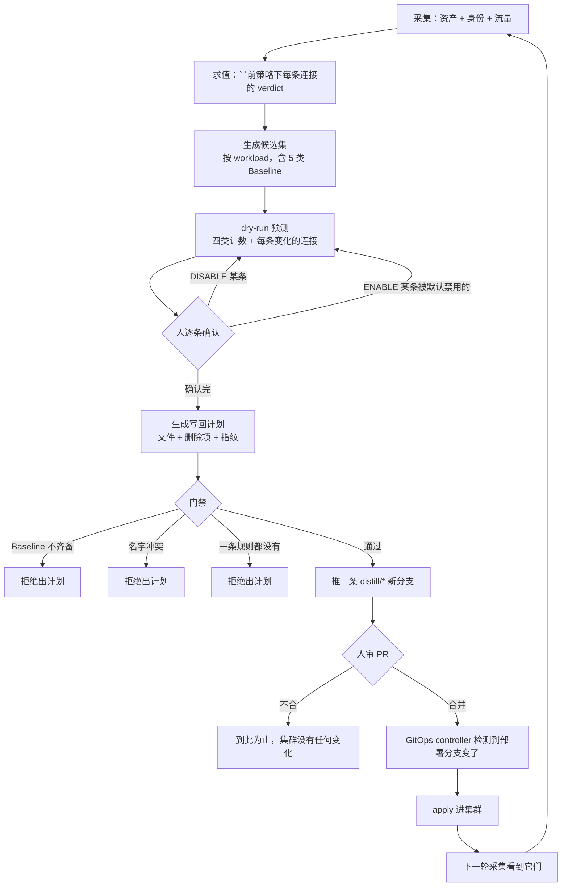
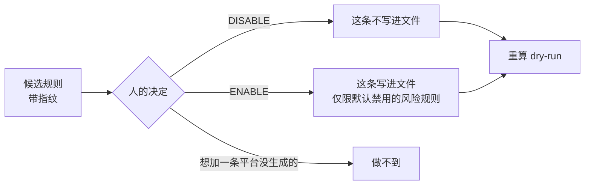
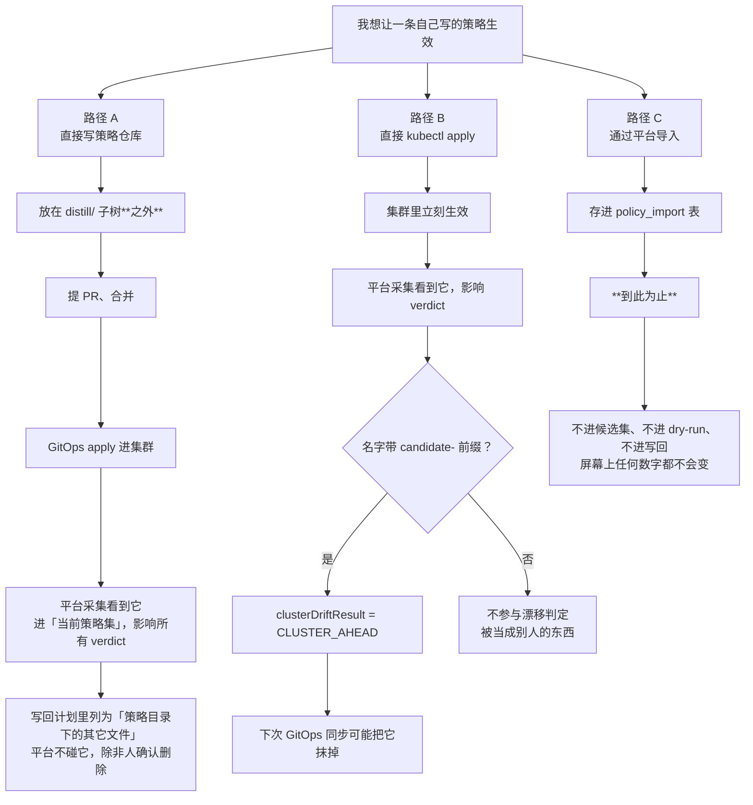
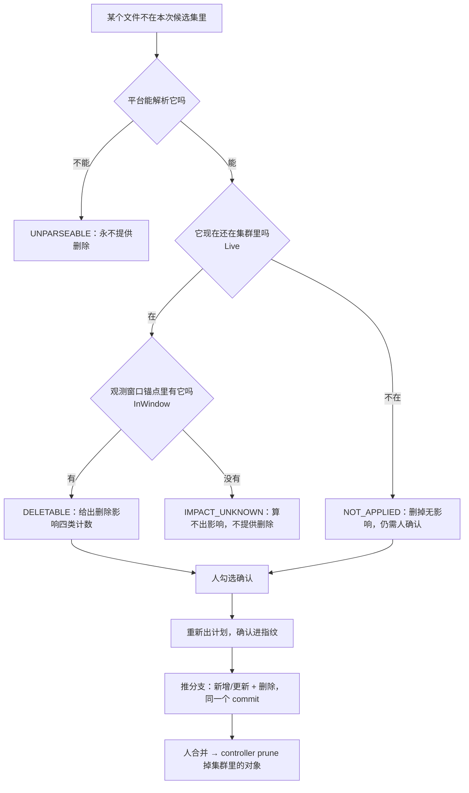
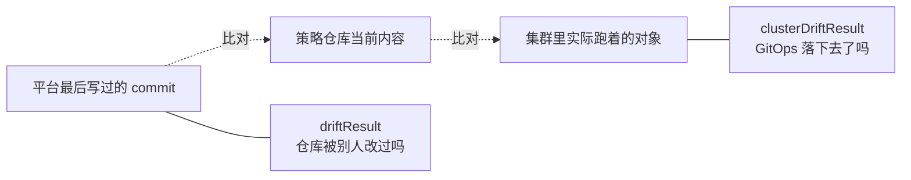

# 策略是怎么生效的

一条 NetworkPolicy 从"平台看到流量"到"集群里真的拦住东西"，中间有哪些步骤、
每一步是谁做的。**平台在任何路径上都不 apply** —— 它推分支，人合并，GitOps
controller 落地。

## 0. 三个主体

| 主体 | 能做什么 | 不能做什么 |
|---|---|---|
| **平台**（distill-api） | 读集群、生成候选、预测影响、推分支到策略仓库 | apply 任何对象；持有集群 NetworkPolicy 写权限 |
| **人** | 逐条确认、合并 PR、直接写仓库、直接改集群 | —— |
| **GitOps controller**（Argo/Flux） | 把仓库里的对象 apply 进集群、prune、selfHeal | —— |

## 1. 系统推荐规则：完整链路

**平台在 H 就停下**。J 与 K 不是平台做的，平台甚至不知道它们发生了没有 ——
这正是 `clusterDriftResult` 存在的理由（见 §5）。

三道门禁（G）各自拦的东西：

| 门禁 | 拦什么 | 为什么 |
|---|---|---|
| Enforcing 门禁 | 必备 Baseline 未齐备 | 每条候选都是 default-deny，缺 Baseline 会切断 DNS / 健康检查 / metrics |
| 名字冲突 | 要写的对象名已被别人占用 | `candidate-` 是保留前缀；覆盖别人的对象在 Git 历史里看不出来 |
| 空集 | 当前时间窗下一条启用规则都没有 | 空的策略文件在不同集群上含义相反 |

## 2. 人工确认（override）能做什么、不能做什么

- **只能开关平台已经生成的规则。** 写入前校验指纹命中当前候选集，页面过期就拒绝。
- **BASELINE 规则不允许禁用**（`ErrBaselineNotDisablable`）：禁掉 DNS 那一条的后果
  不是"少一条规则"，是那一片彻底不通。
- **没有"手写一条规则加进候选集"的入口。** 想加自己的规则，走 §3。

## 3. 用户自定义规则：三条路径

**今天唯一真正可用的是路径 A。** 路径 C 的两个角色字段（`BASELINE_CURRENT` /
`CANDIDATE_ADDITION`）已经定义，但没有任何消费方 —— 这是一个已知缺口。

路径 B 不推荐：它绕过了 Git，仓库与集群从此不一致，而 GitOps controller 的
下一次同步可能把它抹掉（取决于它是否在 Application 的管辖范围内）。

## 4. 删除一条已经生效的策略

`IMPACT_UNKNOWN` 那一支是 GitOps 下的常态时序：平台在窗口 W 出计划、人合并、
controller 在 W 之后才下发 —— 下次出计划时对象是活的，但窗口快照里还没有它。
此时按窗口口径重放，算的是"删掉一个当时并不存在的东西"，恒为无变化。

## 5. 两种漂移，回答两个不同的问题

| 组合 | 含义 |
|---|---|
| `IN_SYNC` + `CONVERGED` | 一切正常 |
| `IN_SYNC` + `PENDING` | **仓库没被动过，但 controller 没同步** —— 合并了却没生效 |
| `DRIFTED` + `CONVERGED` | 有人改了仓库，且已经生效了 |
| 任意 + `CLUSTER_AHEAD` | 集群里有平台的对象、仓库里没有：有人手工 apply 或仓库被回退 |
| 任意 + `UNKNOWN` | 平台没看全 —— **不是"已生效"** |

## 6. 什么时候判定不可信

以下任一成立，`confidence` 就是 `DEGRADED`，**这份结论不得作为收紧策略的依据**：

- 观测窗口完整度不是 `COMPLETE`（采样率未知、有丢弃）
- 集群里存在平台不解释的其它策略平面（Cilium / AdminNetworkPolicy），
  **或平台没能确认有没有**（`otherPlanes = UNKNOWN`）
- 端点在 service mesh 里，L4 身份不可信

## 7. 已知缺口

| 缺口 | 后果 |
|---|---|
| 导入的策略不进任何计算 | 平台上"贴一条策略"这个动作今天没有效果 |
| dry-run 只算候选集，不算「已有 ∪ 候选」 | 预测的世界与 apply 之后的世界不是同一个；方向偏保守，但数字不准 |
| CiliumNetworkPolicy / AdminNetworkPolicy 只检测不解释 | 那类集群只能拿到 `DEGRADED` 判定 |
| 没有"接管"路径 | 候选集生效后，被它取代的旧策略不会自动进删除清单 |
